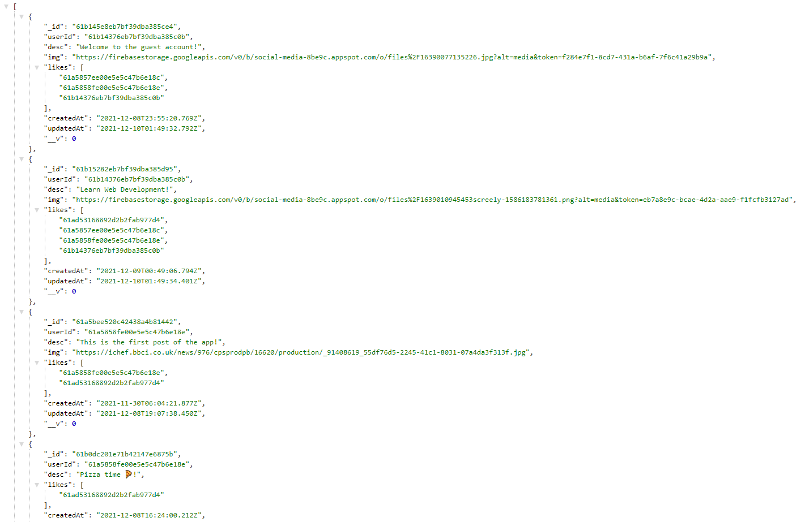

# social-media-api

## Welcome! 👋

weConnect is a fullstack social media web app built with the MERN stack (MongoDB, Express, ReactJS and NodeJS). This is the server side of the web app.

## Build with ⚙️

This is the server side of the social media web app. The server side is built with Express and NodeJS. User password is encrypted with Bcrypt for security. All data are stored in MongoDB.

## Screenshots 📷

## Link 🔗

Server Link :
[Click Me!](https://weconnect-social-media.herokuapp.com/api/posts/timeline/61b14376eb7bf39dba385c0b)

Client GitHub Link:
[Click Me!](https://github.com/obiito01/social-media-client)
